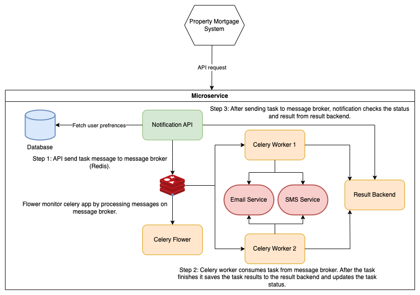

# Property Alert Microservice
The Property Alert Microservice is a Python-based application built using FastAPI, Redis, Celery that allows users to schedule property alert notifications via email and SMS. This README provides instructions for setting up the microservice, its basic usage, running tests, and known limitations.
## Application Architecture


## Environment Setup (macOS only)
### Prerequisites
* Python 3.6+
* Redis (for Celery task queue)

### XCode
Install Xcode Command Line Utilities
```
xcode-select --install
```

### Python3.8
Install pyenv via homebrew and add the init to your .zshrc
#### Intel CPU
```
$ brew install pyenv
$ echo 'eval "$(pyenv init -)"' >> ~/.zshrc
$ source ~/.zshrc
```

Install Python 3.8.5:
```
$ pyenv install 3.8.5
```

#### Apple Silicon CPU
```
$ brew install pyenv
$ echo 'eval "$(pyenv init --path)"' >> ~/.zshrc
$ source ~/.zshrc
```

Install Python 3.8.12 (3.8.10 should be the minimum supported one on MacOS Monterey, Apple Silicon):
```
$ pyenv install 3.8.12
```

### PIP
Install pip3 by running:
```
$ curl https://bootstrap.pypa.io/get-pip.py -o get-pip.py
$ python get-pip.py
```

### Git
```
$ brew install git
```

### Redis
```
$ brew install redis
$ brew services start redis
```

## Project Setup (macOS only)
### Clone the repository:
```
$ git clone https://github.com/mnadeemyounis/property-alert.git
```

### Install, Create and Activate Virtual Environment

Install pyenv-virtualenv with homebrew and add its init to your .zshrc
```
$ brew install pyenv-virtualenv
$ echo 'eval "$(pyenv virtualenv-init -)"' >> ~/.zshrc
$ source ~/.zshrc
```

Create a virtual environment (with Python 3.8.5) for the project and activate it:
```
$ pyenv virtualenv 3.8.5 venv-3.8.5
```
You can set it as default for the repo (activated each time you enter the project's directory).
Execute the following from the root of the repo:
```
$ pyenv local venv-3.8.5
```

Or, alternatively, you can activate it manually and work while it is on:
```
$ pyenv activate venv-3.8.5
```

### Install dependencies
```
$ pip install -r requirements.txt
```

### Alembic Migrations
Database schema is managed by Alembic migrations.
#### Apply existing migrations
To apply all migrations and create up-to-date schema, run the following command:
```
$ alembic upgrade head
```
#### Auto-generating new migrations
When models are changed or new ones are created, Alembic can generate migrations automatically.
```
$ alembic revision --autogenerate -m "Added new processor table"
```

Note: **Currently SQLite database is used.**

### Start Redis server (required for Celery)
```
$ redis-server
```

### Run Celery worker
```
$ celery -A app.tasks.celery worker --loglevel=info
```

### Run Celery flower
To monitor Celery tasks run flower
```
$ celery -A app.tasks.celery flower --port=5555
```

### Run the development server
```
$ uvicorn app.apis:app --reload
```

The microservice should now be running locally on http://127.0.0.1:8000.

## Basic Usage
### Schedule Notification
To schedule a notification, send a POST request to the `/notifications` endpoint with the following JSON payload:
```
{
  "user_id": 123,
  "message": "New property listing available!",
  "notification_type": "email",
  "notification_time": "2024-05-01T21:02:09.052Z"
}
```
Replace `user_id`, `message`, `notification_type`, and `notification_time` with appropriate values.

### Update User Preferences
To update user preferences, send a POST request to the `/preferences/{user_id}` endpoint with the following JSON payload:
```
{
  "email_enabled": true,
  "sms_enabled": false
}
```
Replace `user_id` with the user's ID and set `email_enabled` and `sms_enabled` to true or false as desired.

## Running Tests
To run unit tests, execute the following command:
```
$ pytest
```

## Known Limitations and Areas for Improvement
* **Database Persistence**: Currently, user preferences are stored in SQLite database. Consider using a persistent database (e.g., PostgreSQL) for data storage.
* **Authentication**: Implement authentication mechanisms to secure API endpoints and restrict access to authorized users only.
* **Error Handling**: Enhance error handling to provide meaningful error messages and handle edge cases gracefully.
* **Scalability**: Optimize the microservice for scalability by introducing load balancing and horizontal scaling techniques.
* **Logging and Monitoring**: Implement logging and monitoring to track application behavior, performance metrics, and error occurrences.
* **Real Email/SMS Sending Logic**: Replace mock email and SMS sending logic with actual implementations using SMTP for email and Twilio for SMS.
